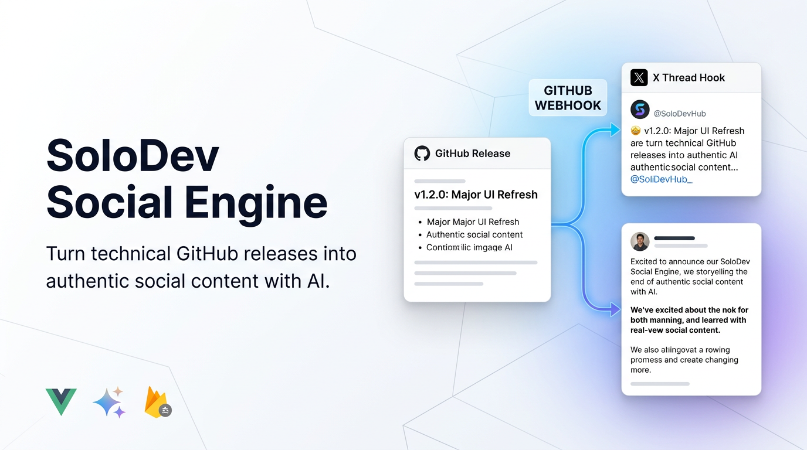

# SoloDev Social Engine




SoloDev Social Engine is a serverless, AI-powered hub that automatically translates technical GitHub releases into authentic, engaging social media content for X (Twitter) and LinkedIn. Eliminate the context-switching tax and maintain a consistent public presence without taking time away from coding.

## 🚀 Quick Start

Get up and running in minutes:

1.  **Use the Live Version:** [https://solodev-social-engine.web.app](https://solodev-social-engine.web.app)
2.  **Setup Auto Release:** Automate your project's release process with this [comprehensive guide and template](https://gist.github.com/navidshad/9b78557cf957f804db56d2dadd1faced).

---

## 🚀 Vision & Goal

Writing code and writing engaging social media copy require two entirely different mental states. This engine solves that problem by catching your technical releases via webhooks, applying your specific "voice" using Google Gemini, and preparing highly engaging drafts that just need a quick review before publishing. 

## ✨ Core Features

*   **The "Brand Control" Dashboard:** A private, authenticated web interface to manage your API keys, platform integrations, and customized "Persona & Voice Configuration."
*   **AI Content Generation Engine:** Powered by Google Gemini. Automatically triggered by GitHub release webhooks to ingest release notes, extract images/diagrams, and draft platform-specific posts.
*   **Draft & Review Workflow (The Inbox):** A centralized queue of AI-generated announcements. Review drafts side-by-side with your raw notes, make edits, and publish.
*   **Automation Toggles:** Option to enable auto-posting, skipping the review process for instant publishing.
*   **Sent Log:** A historical record of everything published through the engine.

## 🛠 Tech Stack (The Solo Dev Stack)

Designed to be low-maintenance and heavily utilize free tiers.

*   **Frontend UI:** Vue 3 (Vite), TypeScript, Tailwind CSS
*   **UI Framework:** [PilotUI](https://pilotui.com/)
*   **Backend Orchestration:** Firebase Cloud Functions (Node.js)
*   **Database:** Cloud Firestore
*   **Authentication:** Firebase Auth (Google Provider / GitHub integration)
*   **Hosting:** Firebase Hosting
*   **AI Integration:** Google Gemini API

## 💻 Project Development Setup

### Prerequisites
*   Node.js (v20+)
*   Yarn or npm
*   Firebase CLI (`npm install -g firebase-tools`)
*   A Firebase Project with Firestore, Functions, Auth, and Hosting enabled.

### Environment Variables
You'll need a `.env.local` for frontend config, and separate secrets/environment variables for Cloud Functions (e.g., `GEMINI_API_KEY`, `X_API_KEY`, `LINKEDIN_CLIENT_ID`).

### Install Dependencies
```sh
yarn install
# or
npm install
```

### Run Frontend Locally
```sh
yarn run dev
# or
npm run dev
```

### Build & Deploy
Deploying the frontend to Firebase Hosting:
```sh
npm run build
npx firebase-tools deploy --only hosting
```

Deploying Cloud Functions:
```sh
npx firebase-tools deploy --only functions
```

## 📄 License
This project is licensed under the ISC License.
